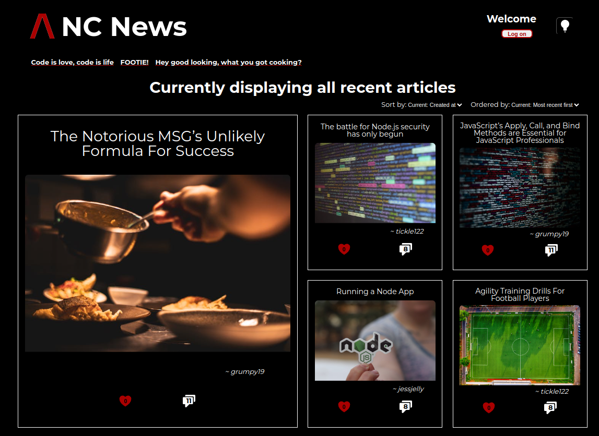

# [NC News](https://blurryqs-nc-news.netlify.app/articles)



## Summary

**Hosted site** [NC News](https://blurryqs-nc-news.netlify.app/articles)

Northcoders News is a platform for sharing and discussing news across a variety of topics. Users can upvote or downvote articles, leave comments, and get involved in active discussions. The project is built on RESTful API principles, allowing for full CRUD functionality (users can create, read, update, and delete articles and comments). This project demonstrates effective REST API consumption and dynamic handling of user interactions.

## Requirements

**Node:** v20.12.2 +

## Dependencies

[React](https://react.dev/) A JavaScript library for building user interfaces.<br>
[Vite](https://vitejs.dev/) A fast and modern build tool optimized for front-end development, offering quick server startup and hot module replacement.<br>
[axios](https://axios-http.com/) Used for making HTTP requests to the NC News API.<br>
[react-router-dom](https://reactrouter.com/en/main) Enables navigation between different views/pages within the app.<br>
[react-spinners](https://www.davidhu.io/react-spinners/)Provides loading indicators to enhance the user experience while fetching data.<br>
[Jest](https://jestjs.io/) A testing framework for ensuring the app is robust and reliable through unit tests.<br>

## Back End

**Hosted API** [NC News](https://nc-news-lbn1.onrender.com/api)<br>
**GitHub Repo** [nc-news-be](https://github.com/BlurryQ/nc-news-be)

## Setup

To get started with this project, follow the steps below:

### 1. For the Repository

First you need to fork this repo to your GitHub account by clicking fork button near the top right of this page. If you are unfamiliar with this then please follow this GitHub [guide](https://docs.github.com/en/pull-requests/collaborating-with-pull-requests/working-with-forks/fork-a-repo).

### 2. Clone the Repository

The next step is cloning this to your local device using the follwoing command, changing the "your-username" to your GitHub username:

```
git clone github.com/your-username/nc-news
```

### 3. Install Dependencies

Now this has been done install all the npm dependencies by running the following command in your terminal/ cli:

```
npm install
```

### 4. Run Project

Once this has installed you can type the following into terminal to run the project.

```
npm run dev
```

### Northcoders

This portfolio project was created as part of a Digital Skills Bootcamp in Software Engineering provided by [Northcoders](https://northcoders.com/)
